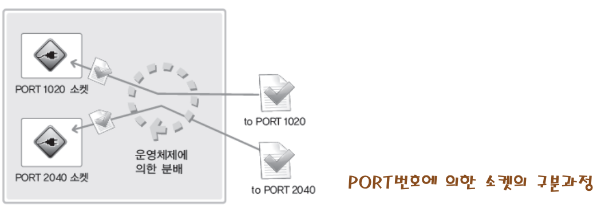

# 3. 주소체계와 데이터 정렬

## 목차
1. [소켓에 할당되는 IP주소와 PORT번호](#1-소켓에-할당되는-ip주소와-port번호)
2. [주소정보의 표현](#2-주소정보의-표현)
3. [네트워크 바이트 순서와 인터넷 주소 변환](#3-네트워크-바이트-순서와-인터넷-주소-변환)

## 1. 소켓에 할당되는 IP주소와 PORT번호

### ⦁ 소켓의 구분에 활용되는 PORT번호

#### - PORT 번호
- IP는 컴퓨터를 구분하는 용도로 사용되며, PORT번호는 소켓을 구분하는 용도로 사용된다.
- 하나의 프로그램 내에서는 둘 이상의 소켓이 존해할 수 있으므로, 둘 이상의 PORT가 하나의 프로그램에 의해 할당될 수 있다.
- PORT번호로 16비트로 표현, 따라서 그 값은 0 이상 65535 이하
- 0~1023은 잘 알려진 PORT(Well-known PORT)라 해서 이미 용도가 결정되어 있다.



## 2. 주소정보의 표현

### ⦁ IPv4 기반의 주소표현을 위한 구조체
```c
struct sockaddr_in
{
    sa_family_t sin_family; // 주소체계
    uint16_t sin_port; // PORT 번호
    struct in_addr; // 32비트 IP주소
    char sin_zero[8]; // 사용되지 않음
};
```
```c
struct in_addr
{
    in_addr_t s_addr; // 32비트 IPv4 인터넷 주소
};
```
| 자료형 이름 | 자료형에 담길 정보
|:---:|:---:
| int8_t | signed 8-bit int|
| uint8_t | unsigned 8-bit int (unsigned char)
| int16_t | signed 16-bit int
| uint16_t | unsigned 16-bit (unsigned short)
| int32_t | signed 32-bit int
| uint32_t | unsigned 32-bit int (unsigned long)
| sa_family_t | 주소체계(address famliy)
| socklen_t | 길이정보(length of struct)
| in_addr_t | IP주소정보, uint32_t 정의되어 있음
| in_port_t | PORT번호정보, uint16_t로 정의되어 있음

### ⦁ 구조체 sockaddr_in의 멤버에 대한 분석

#### - 멤버 sin_family
- 주소체계 정보 저장

#### - 멤버 sin_port
- 16비트 PORT번호 저장
- 네트워크 바이트 순서로 저장

#### - 멤버 sin_addr
- 32비트 IP주소정보 저장
- 네트워크 바이트 순서로 저장
- 멤버 sin_addr의 구조체 자료형 in_addr 사실상 32비트 정수 자료형

#### - 멤버 sin_zero
- 특별한 의미를 지니지 않는 멤버
- 반드시 0으로 채워야 한다.

| 주소체계(Address Family) | 의미
|:---:|:---:|
|AF_INET| IPv4 인터넷 프로토콜에 적용하는 주소체계
|AF_INET6|IPv6 인터넷 프로토콜에 적용하는 주소체계
|AF_LOCAL|로컬 통신을 위한 유닉스 프로토콜의 주소체계

### ⦁ 구조체 sockaddr_in의 활용의 예
```c
struct sockaddr_it serv_addr;

if(bind(serv_sock, (struct sockaddr*) &serv_addr, sizeof(serv_addr)) == 1)
    error_handling("bind() error");
// 구조체 변수 sockaddr_in은 bind 함수의 인자로 전달되는데, 매개변수 형이 sockaddr이므로 형 변환을 해야만 한다.
```
```c
struct sockaddr
{
    sa_family sin_family; // 주소체계(Address Family)
    char sa_data[14] // 주소정보
}
// 구조체 sockaddr은 다양한 주소체계의 주소정보를 담을 수 있도록 정의되었다. 그래서 IPv4의 주소정보를 담기가 불편하다. 이에 동일한 바이트 열을 구성하는 구조체 sockaddr_in이 정의되어 있으며, 이를 이용해서 쉽게 IPv4의 주소정보를 담을 수 있다.
```

## 3. 네트워크 바이트 순서와 인터넷 주소 변환


endian_conv.c

```bash
ubuntug@ubuntug:~/c_c++/Tcp:Ip/Ch3$ gcc endian_conv.c -o conv
ubuntug@ubuntug:~/c_c++/Tcp:Ip/Ch3$ ./conv 
Host ordered port: 0x1234 
Network ordered port: 0x3412 
Host ordered address: 0x12345678 
Network ordered address: 0x78563412 
ubuntug@ubuntug:~/c_c++/Tcp:Ip/Ch3$
```

inet_addr.c

```bash
ubuntug@ubuntug:~/c_c++/Tcp:Ip/Ch3$ gcc inet_addr.c -o addr
ubuntug@ubuntug:~/c_c++/Tcp:Ip/Ch3$ ./addr 
Network ordered integer addr: 0x4e7cd47f 
Error occureded 
ubuntug@ubuntug:~/c_c++/Tcp:Ip/Ch3$
```

inet_aton.c
```bash
ubuntug@ubuntug:~/c_c++/Tcp:Ip/Ch3$ gcc inet_aton.c -o aton
ubuntug@ubuntug:~/c_c++/Tcp:Ip/Ch3$ ./aton 
Network ordered integer addr: 0x4f7ce87f 
ubuntug@ubuntug:~/c_c++/Tcp:Ip/Ch3$ 
```

inet_ntoa.c
```bash
ubuntug@ubuntug:~/c_c++/Tcp:Ip/Ch3$ gcc inet_ntoa.c -o ntoa
ubuntug@ubuntug:~/c_c++/Tcp:Ip/Ch3$ ./ntoa 
Dotted-Decimal notation1: 1.2.3.4 
Dotted-Decimal notation2: 1.1.1.1 
Dotted-Decimal notation3: 1.2.3.4 
ubuntug@ubuntug:~/c_c++/Tcp:Ip/Ch3$ 
```